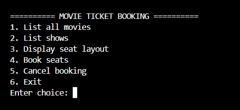
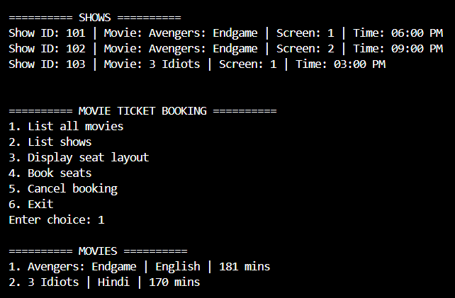
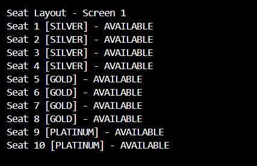
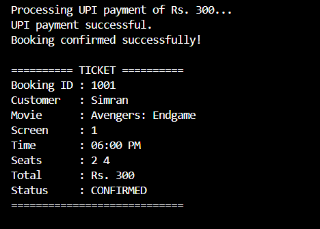
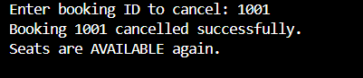

# Movie Ticket Booking System

A menu-driven C++ console application for booking movie tickets in a cinema.

## Features

* List currently playing movies
* Display shows for movies
* Display seat layout and availability
* Book one or more seats
* Reject already-booked seats
* Seat-based pricing
* UPI, Card, and Cash payment
* Payment failure handling
* Ticket generation
* Booking cancellation
* Seats become available after cancellation

## Demo Screenshots

### Main Menu


### Movie List


### Seat Layout


### Successful Booking


### Booking Cancellation


## Seat Pricing

| Seat Type | Price |
| --------- | ----: |
| SILVER    |  ₹150 |
| GOLD      |  ₹250 |
| PLATINUM  |  ₹400 |

## Technologies Used

* C++
* Object-Oriented Programming
* C++17
* STL `vector`

## OOP Concepts Demonstrated

* Encapsulation
* Abstraction
* Inheritance
* Runtime Polymorphism
* Compile-time Polymorphism
* Composition
* Aggregation
* Association
* Static Members
* `this` Keyword

## SOLID Principles

The project demonstrates:

* Single Responsibility Principle
* Open/Closed Principle
* Liskov Substitution Principle
* Interface Segregation Principle
* Dependency Inversion Principle

## Project Structure

```text
main.cpp
Movie.cpp
Seat.cpp
Screen.cpp
Cinema.cpp
Show.cpp
ShowSeat.cpp
Customer.cpp
Booking.cpp
Payment.cpp
UpiPayment.cpp
CardPayment.cpp
CashPayment.cpp
PriceCalculator.cpp
TicketPrinter.cpp
BookingService.cpp
assignment-writeup.md
README.md
```

## How to Compile

```bash
g++ -std=c++17 main.cpp -o movie_booking
```

## How to Run

### Windows

```bash
.\movie_booking.exe
```

### Linux/macOS

```bash
./movie_booking
```

## Sample Movies

* Avengers: Endgame
* 3 Idiots

## Scope Limitation

This project uses simulated payment processing. No real payment gateway or database is implemented because they are outside the required assignment scope.

## Author

B.Tech CSE – System Design (TCS-504)
